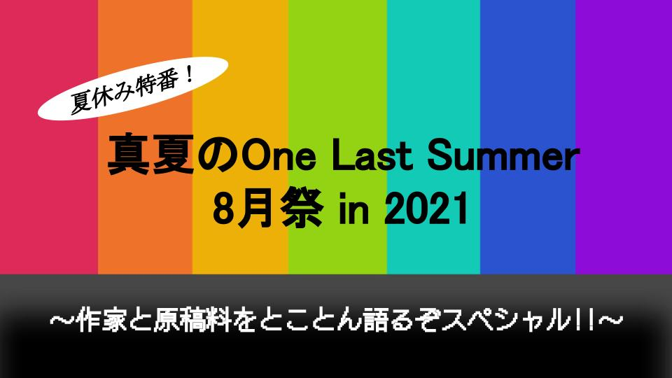

# 勉強会の時間割

## 【タイトル】
夏休み特番！真夏のOne Last Summer 8月祭 in 2021
～作家と原稿料をとことん語るぞスペシャル!!～

## 【企画内容】
全3時間半の長丁場で、先行文献の紹介、昨今の諸問題の討議、準備号の感想戦を一挙に行うオンライン配信番組。

## 【プログラム】
### 第1部：先輩的文献の読書会（20:00-20:30/30分）
* オープニング：2分
* 文献紹介：5分
* 要点サマリ―：10分
* 自己紹介とスタッフ紹介：10分

休憩：3分

### 第2部：トーク番組「読み書きとお金にまつわるエトセトラ」（20:30-21:30/60分）
* オープニング：3分
* コーナー1：25分「「個の対話」を大切にする、me and you社の創業とこれから」
  * ゲスト：野村由芽さん・竹中万季さん（株式会社me and you）、聞き手：小澤
* 場面転換と告知：3分
* コーナー2：25分「持続可能で・透明な「出版」の潜在性」
  * ゲスト：熱海凌さん、聞き手：笠井
* 場面転換と告知：3分
* エンディング：3分

休憩：3分

### 第3部：「作家の手帖」準備号の感想会（21:30-23:30/120分）
* イントロダクション：5分
* 原稿1：15分
  * ゲスト：ひらりささん
* 場面転換と告知：3分
  * ショートスピーチ：樋口芽ぐむさん
* 原稿2：15分
  * 伏見瞬さん
* 場面転換と告知：3分
  * ショートスピーチ：調整中
* 原稿3：15分
  * ゲスト：poroLogueさん
* 場面転換と告知：3分
  * ショートスピーチ：棒さん  

休憩3分

* 原稿4：15分
  * ゲスト：関口竜平さん
* 場面転換：3分
* 原稿5：15分
  * ゲスト：大滝瓶太さん
* 場面転換と告知：3分
  * ショートスピーチ：大滝瓶太さん
* 原稿6：15分
  * トーク：小澤（うっかりさんの原稿+自分の原稿について）
* クロージング：5分
  * トーク：笠井・小澤  

## 【クレジット】

# [TOPページ](./index.md)

