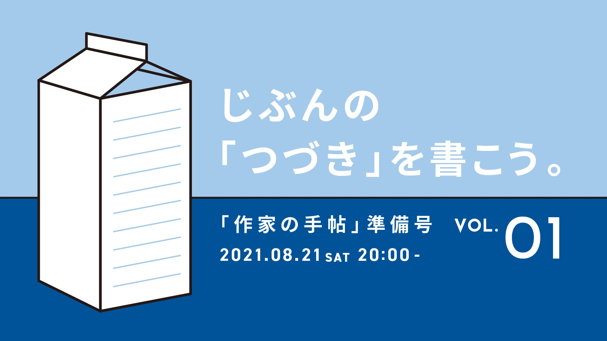

# 作家の手帖

同人誌「特集：原稿料」という仮称で温めていた企画を、**「作家の手帖」** と題して始めることになりました。編集長は[笠井康平](https://twitter.com/kasaikouhei)・[小澤みゆき](https://twitter.com/miyayuki777)が務めます。

## 目次
[特徴](#特徴) 

[参加方法](#参加方法)

[編集長プロフィール](#編集長プロフィール)

[規約類・事務書類](#規約類・事務書類)

[かっこいい引用](#かっこいい引用)

[お問い合わせ](#お問い合わせ)

# 特徴
**広い意味での「原稿料」を主題に、出版活動の流れ自体を目次として、ウェブに掲載される同人誌です。** 執筆者・制作スタッフを公募し、先に契約を結んでから、最終稿以外のテキストを[GitHub](https://github.com/Writer-Life-Committee/authors-note)で公表することで、**どの原稿がどのように執筆・編集・校正されたのかをみんなで共有できるようにする試みです。**

本サイトには「作家の手帖」の制作過程が掲載されます。GitHub Pagesという仕組みを用いて、Githubに掲載した原稿がそのまま記事になります（**完成稿は購読者限定です**）。GitHubとは、ざっくりいうと、文書管理や共同作業を行うサービスです（詳しいサービス内容や仕組みは、[公式ページ](https://github.co.jp/)をごらんください）。

## これまでのあらすじ
4月18日に情報解禁され、執筆者とスタッフを公募。[「共通執筆依頼書」](request.md)をもとに作業を依頼し、テキストを執筆・編集。8月18日に準備1号が完成し、8月21日には刊行記念のオンライン勉強会を行いました。9月末まで「清算」「休養」期間に入り、10月から次の企画がまた始まります。全20の目次に記事が揃うまで、活動を続けます。

## スタッフ紹介
- 執筆者（8名）[笠井康平](kasai.md)、[うっかり](ukkari.md)、[ひらりさ](hirarisa.md)、[伏見瞬](fushimi.md)、[大滝瓶太](ohtaki.md)、[関口竜平](sekiguchi.md)、[小澤みゆき](ozawa.md)、[poroLogue](porologue.md)
- 編集者（3名）笠井康平、小澤みゆき、Raise
- 制作事務（2名）笠井康平、小澤みゆき、皐月うしこ
- デザイン（1名）月城美穂
- 校閲・校正（1名）北出栞
- 印刷オペレーション（技術サポート）（2名）小澤みゆき、paina
- 会計（2名）しお、木田愛希
- 監査役（1名）poroLogue
- 勉強会の配信実務（1名）seshiapple
- 勉強会の登壇者（2名～）熱海凌、竹中万季・野村由芽（株式会社ミーアンドユー）
- 勉強会のショートスピーチ（7名まで）高橋文樹、樋口芽ぐむ、棒、seshiapple、大滝瓶太
- Special Thanks
  - 資料提供（2名）長瀬海　野崎タラ
  - 3Dモデリング(1名）清水香央理
  - GitHub Contributors（4名）[ATOHSaaa](https://github.com/ATOHSaaa) [MATSUMOTO Katsuyoshi](https://github.com/katsyoshi)　[Kato Akiru](https://github.com/paithiov909)　[sakaiharuka](https://github.com/sakaiharuka)

## 準備1号の目次
【1.企画趣旨】
- [笠井康平「原稿料400年の歴史――どうして作家は昔からいまいち儲からないのか？」](kasai.md)

【4.原稿料】
- [うっかり「俳句とお金」](ukkari.md)

【6.契約・交渉】
- [ひらりさ「原稿料をとりっぱぐれたくない私のセブンルール」](hirarisa.md)

【7.選考】
- [伏見瞬「「ズレ」が「ズレ」でなくなる時](fushimi.md)

【8.執筆】
- [大滝瓶太「WEBライティングの熱力学的な死――──そのテクストの「意思」の所在」](ohtaki.md)

【15.流通・販売】
- [関口竜平「書くということ——ただ「置く」だけではない、＜メディア＞のひとりとしての書店」](sekiguchi.md)

【16.パブリシティ】
- [小澤みゆき「PRのための「周辺」原稿](ozawa.md)

【18.財務・会計】
- [poroLogue「原稿料はどう決める？――Webメディアの副編集長が作り上げた「事業と財務」の対話を促す経理の仕組み」](porologue.md)

[勉強会の時間割](event-vol1.md)も公開しました（2021/8/8）。

## もっと知りたい方へ
[README（「作家の手帖（特集：原稿料）」企画書ワーキングドラフト）](https://github.com/Writer-Life-Committee/authors-note/blob/main/README.md)をごらんください。

# 参加方法

## 購読希望の方へ
[STORES](https://authors-note.stores.jp/)で参加チケットを販売しています。購入すると、次の特典を受け取れます。
- 完成稿（PDF/epub）の入手
- 制作過程（草稿/編集稿/初稿/校正稿）の赤入れやコメントの閲覧
- オンライン勉強会のアーカイヴ動画視聴
- 参加者コミュニティ（Discord）への参加
- 招待状（紙）（残部数限り）

このささやかな取り組みを支援していただける方は、ぜひ参加チケットをお買い求めください。

 

	<a href="https://authors-note.stores.jp/items/6078e843d5e9c9671858a8ec/" class="button">チケットを購入する</a>

 

## 執筆者・制作スタッフの応募
[企画書](https://github.com/Writer-Life-Committee/authors-note/blob/main/README.md)、[参加規約](https://drive.google.com/file/d/1sdMW6EdLK1p4aA9PHed0taeW_L3otoYH/view?usp=sharing)、[プライバシーポリシー](https://drive.google.com/file/d/1ZODNOIVU4Qmu_jOpr68ruonYXJYiKA05/view?usp=sharing)
をお読みいただいた上で、Googleフォームからご応募ください。執筆・登壇・制作スタッフ募集のほか、体験談の投稿（匿名可）もあわせて受け付けます（2021/4/18）。
10月以降に次の企画をご案内します。ご関心のある方は、お気軽にご応募ください（2021/8/25）。

## 共通執筆依頼書
「作家の手帖」に執筆者として応募したい方、編集部が執筆依頼したい方に伝えるための[「共通執筆依頼書」（Common Request for Writing）](request.md)を公開しました（2021/4/25）。

# 編集長プロフィール

## 笠井康平（[@kasaikouhei](https://twitter.com/kasaikouhei)）
1988年生まれ。東京都在住。会社員。著書に[『私的なものへの配慮No.3』](http://inunosenakaza.com/shitekinamono.html)（いぬのせなか座）。近著に[「文化芸術の経済統計枠組みはいかにしてテキスト品質評価指標体系の開発計画に役立つのか」「文化と経済をめぐるブックリスト」](http://www.bungaku.net/wasebun/magazine/wasebun2020win.html)[「現代短歌のテキストマイニング――𠮷田恭大『光と私語』（いぬのせなか座）を題材に」](https://note.com/inunosenakaza/m/m1301c2435627)。すきなものが、すきです。

## 小澤みゆき（[@miyayuki777](https://twitter.com/miyayuki777)）
1988年生まれ。東京都在住。会社員。編著に[『かわいいウルフ』](https://www.akishobo.com/book/detail.html?id=1004)（亜紀書房）。近著に[「ウルフ・チャット」](http://gunzo.kodansha.co.jp/55737/58875.html)[「文芸という海――メジャーとインディペンデントの波間で」](http://gunzo.kodansha.co.jp/55737/58811.html)[「若さの予感」](https://liondo.thebase.in/items/27827476)。すきなお酒は「一番搾り」。

# 規約類・事務書類
[リーガルページ](./regal.md)をごらんください。

# かっこいい引用
> すべての文化集団は，独自の言語，文字，書記システムを持つ．それゆえ，個々の書記システムをサイバースペースに移転することは，文化的資産の継承という意味で，情報通信技術にとって非常に重要な責務といえよう．[日本語組版処理の要件（日本語版）](https://www.w3.org/TR/jlreq/) 

# お問い合わせ
[FAQページ](./faq.md)をごらんいただき、以下までお問い合わせください。

文筆生活向上委員会（担当：笠井・小澤）

writer.life.committee[at]gmail.com