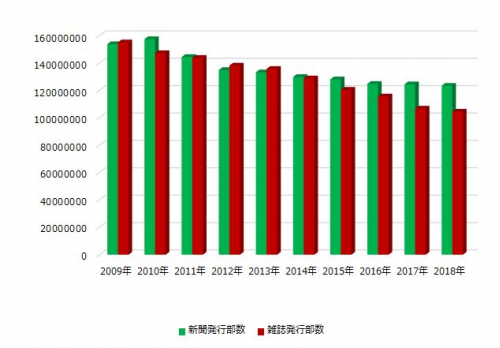
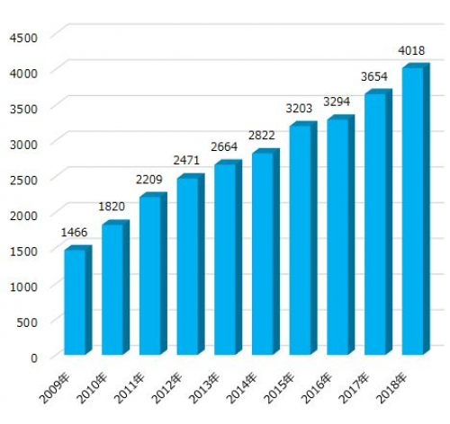
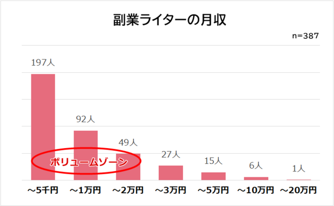
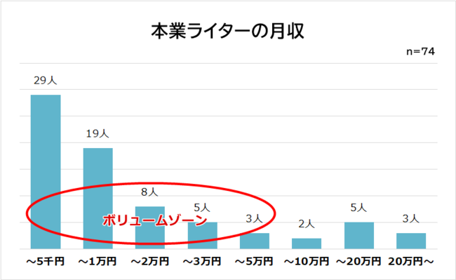
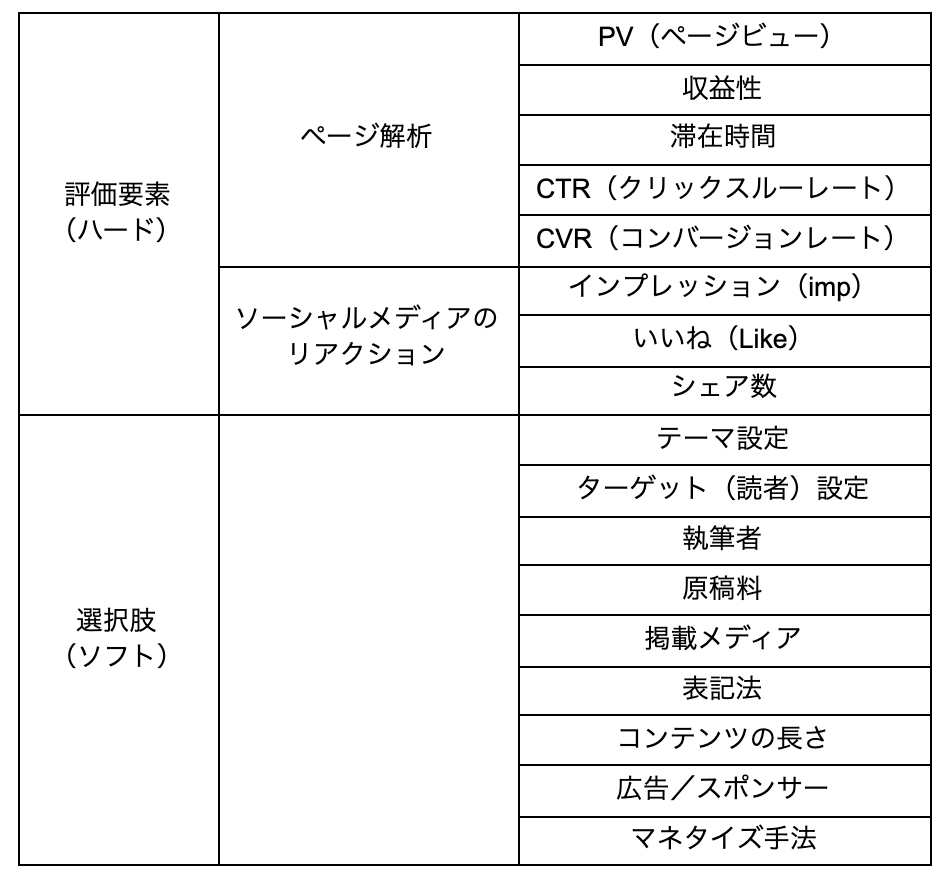

# 大滝瓶太

# 担当する目次
8.執筆：文体／語句／構文／内容／構成／倫理

# 主題または仮題
戦場化するWEBライティング──その文体の「意思」の所在

# プロフィール
86年生まれ。作家。「SFマガジン」（早川書房）や「小説すばる」（集英社）で小説・書評などを執筆。

# 草稿

> 少年たちは流行のダイエット法を売り込む場合と同じく、自分たちのターゲットが欲しがりそうだという理由だけで政治に関する嘘を書き込んだ。「水が好きだとわかったら水を与える」とドミトリは言った。「ワインが好きならワインを与える」。だがこのビジネスには一つの鉄則があった。トランプの熱烈な支持者を狙え、というものだ。ティーンエイジャーたちはトランプの政治的メッセージを特に気にしていたわけではないが、ドミトリによれば、彼らの作り話をクリックすることにかけてはトランプ支持者は「無敵だった」そうだ。
> ──P. W. シンガー・エマーソン.T .ブルッキング著、小林由香利訳、『「いいね！」戦争　兵器化するソーシャルメディア』

> 生物の進化と技術の進化の主要な側面が、同じ法則で支配されている可能性はないだろうか。生物と人工物はともに設計上の制約、それもたがいに矛盾するような制約条件に縛られている。すでに示したように、この制約がでこぼこの適応地形を作り出している。われわれは市場の選択原理の圧力を受けながら、意図を持って技術の可能性の空間を歩き回っている。しかし、もし根底にある設計の問題が生物進化の適応地形と似たようなものを作り出すとしたら、同じ法則が生物と技術の進化を司っているとしても驚くにあたらない。生物組織も人工物も本質的な部分では似たような法則で進化しているのかもしれない。
> ──スチュアート・カウフマン著、米沢富美子訳、『自己組織化と進化の論理　宇宙を貫く複雑系の法則』

## わたしたちの意思ですらない表現──自己組織化する散文表現

いまもってこうして文章を綴りながらも、じぶんの意思というのはわからない。

もちろん何らかの依頼を受け、何かを考え、大なり小なりの伝達を試みようとはしていて、成果物として納品する文章はおそらくじぶん以外に書けるものではなく、もっといえば書いたじぶんですらもう一度一字一句正確に辿りなおすことなんてできないのだけれど、ならばこの文章はどこからやってきたのかとふとおもう。こうして書き出された文章は、ぼくの手で書かれながらもぼくではない意思によって構造化されていく。いまのところ何がどうなりどう着地するかはわからないが、ひとまず何らかの形にはなるのはわかっている。ぼくの意思ではなく、ライティングというシステムによって。

自然言語による表現は定量的な評価から逃れることができるのを美徳としているふしがある。ある一定の評価値（軸）のもとでの競争が起これば、そこでの正しさはその値を最大化するものであり、強きは生き残り弱きは淘汰されるのが自然の摂理であるとわりと素直にぼくらは理解できてしまう。それから逃れるとはつまり、評価の高低が価値ではなく個性と見做すことであり、にもかかわらずぼくらはそれぞれにそれぞれの尺度を持って目についた表現の良し悪しを意識的にも無意識的にも評価しようとしてしまう。

どれだけ理解でき、どれだけ共感でき、どれだけ有益であるか──それらに基づいた序列化はみずからの内でブラックボックスで、それを詳らかにしようと開いてみても黒い箱のなかには黒い箱があるだけに過ぎず、どこまで深くにすすんでも「わたし」の姿は一向に現れない。かくしてぼくらは箱を開くのをあきらめ、代わりにこの黒いからくり箱の仕組みについて考える。箱の中身がわからないなら箱が何であるかを考えると、ある荒野が目の前に現れる。

適応度地図は数理生物学で用いられる概念で、ある生物個体が任意のパラメータで定義された環境にどれだけ適しているかを示したグラフである。高いほど快適な環境を示し、従って生物個体は手当たり次第に近くの山の頂上を目指して登ろうとする。

この運動が観念上の「進化」と呼ばれるものであり、適応度を最大にするようにして生物個体は身体機能を変化させていく。よくあるたとえを使えば、光が届かない暗闇で生きる生物が視覚を退化させ聴覚を発達させるのもそれが身を置く環境への適応度を最大化させるためであり、しかしそれは生物個体みずからの意思ではなくあくまでも外的要因（環境）に要請された変化であり、あえて大袈裟に言い換えるならば「生きよう」とする意思は生物個体の本能ですらないのかもしれない。ただそこに存在してしまったという事実が個体を生き延びさせていて、「わたし」の形を「わたしたち」は選べないという現実がここにある（Figure1）。

**Figure 1 適応度地形（イメージ）**
生物の進化はこの図の高いところへ移動するように行われる。しかし問題は、ローカルマキシマムにトラップされること。ある山のてっぺんに行ったものの「実はもっと高い山がありました」となるこのは珍しくなく、これはなかなか嬉しくない。つまり、地形全体を見渡した上でグローバルマキシマムを探索する方法（最適化問題や巡回セールスマン問題にもつながる）があれば嬉しい。「突然変異」というやつはこの図でいうところの、ローカルマキシマムにトラップされた個体を山から一旦降ろして違う山に登らせるみたいな現象と考えれば分かりやすい。 （引用：[https://ja.wikipedia.org/wiki/適応度](https://ja.wikipedia.org/wiki/適応度)）

本稿で対象にするのはこの薄弱にして争い難い、ときに「神の見えざる手」とも呼ばれる何者かの意思の所在だ。近年のソーシャルメディアの発展にともない劇的に発達・構造化されてきたWEBライティングを題材に、その文体が最適化されるシステムならびに数理モデルを仮定し、自然現象としての文章表現について考察する。

## WEBライティングの成果物評価と原稿料

いにしえの時代から語り継がれることばで「若者の活字離れ」というものがある。その真偽を直接示すデータではないが、ひとまず以下のFigure 2及びFigure 3を見てもらいたい。

これらは2009年から2018年の10年間で紙メディアの刷り数とWEBメディアの件数の推移であるが、比率にして紙メディアが刷られなくなった度合いが緩やかであるのに対し、WEBメディアの増加比率は極めて大きい。これを見ると、若者（という限定すら意味がないかもしれない）が活字を読まなくなったかどうかは傍に置くとして、ひとまずWEBメディアの需要はこの10年で非常に高くなったというのはわかる。

街路やカフェ、学校、電車などどこを見ても手に持ったスマートフォンに視線を落とすひとびとはたくさんいるのは経験的にすでに誰もが知っていることになっているだろう。活字はかつてに比べ読まれなくなっているのかもしれない、しかし、文章メディア自体はかつて以上に読まれている可能性がある。ネットニュース、ブログ、SNS、コミュニケーションツール……インターネットを経由してぼくらが日々摂取する情報のほとんどは文字の形をしている。

**Figure 2 2009年〜2018年の発行部数推移**
（引用：[https://digitalpr.jp/r/30895](https://digitalpr.jp/r/30895)）

**Figure 3 2009年〜2018年ニュースサイトの調査媒体数推移**
（引用：[https://digitalpr.jp/r/30895](https://digitalpr.jp/r/30895)）

日々大量に吐き出される文字情報。

もちろんそれは誰かの手によって書かれたものだ。

特にゼロ年代後半から10年代前半は「ネットで文章を書けば金になる」ことがなんとなく知られるようになってきた時代だった。芸能・時事ネタの速報記事、販売促進用のブログ制作などでは特に専門的な経験もスキルも必要とされず、また「いつでも・どこでも」仕事ができる手軽さ、「物書きとして働きたい」というぼんやりとした憧れがあいまって、WEBライティングが内職として広まった。

言い方を変えると、文筆業はそれまで出版社や編集プロダクションで経験をつんだ人間が行なっていた仕事だと思われていたが、ものによってはそうではないことが明らかになった。WEBライターという仕事がだれでも簡単にはじめられるようになった結果、WEBライターの生産性を軸にした市場構造が形成されるに至った。

**Table 1 WEBライターの原稿料相場**
（引用：[https://upwrite.jp/blog/35](https://upwrite.jp/blog/35)）

<table>
  <tr>
   <td>
   </td>
   <td>１文字あたりの単価相場
   </td>
   <td>補足
   </td>
  </tr>
  <tr>
   <td>有名ライター
   </td>
   <td>100円以上
   </td>
   <td>SEOやバズで数字を持っているライター
   </td>
  </tr>
  <tr>
   <td>上級ライター
   </td>
   <td>15円〜20円
   </td>
   <td>豊富な経験、元記者、専門領域を持つライター
   </td>
  </tr>
  <tr>
   <td>中級ライター
   </td>
   <td>3円〜15円
   </td>
   <td>ライターとしての社員経験や数年以上の経験があるライター
   </td>
  </tr>
  <tr>
   <td>初心者ライター
   </td>
   <td>1円〜3円
   </td>
   <td>未経験からスタートしてある程度しっかりした記事を書けるライター
   </td>
  </tr>
  <tr>
   <td>未経験ライター
   </td>
   <td>0.1円〜1円
   </td>
   <td>ほとんど記事を書いたことがないライター
   </td>
  </tr>
</table>

上に挙げたTable 1は、WEBライターのおおまかな原稿料相場だ。特に経験やコネもない状態からWEBライターをはじめる方法を知りたければ、「WEBライター　募集」あたりでググってみるといい。クラウドソーシングサイト（ランサーズやクラウドワークスなど）に登録して案件を取得するか、独自にライターを募集しているメディアの求人に応募して採用されればWEBライターになれる。

こうした経緯でWEBライターになると報酬はTable 1 の最下層「未経験ライター」からスタートする。この金額の仕事は「クライアントの契約先となる企業・店舗の商品の販促記事」がメインで、「SEOライティング」と呼ばれるキーワード検索を意識した記事制作を行うことになる。ちなみにぼくがはじめて受けた仕事は静岡県にある葬式屋のPR記事で、「静岡　家族葬」「静岡　葬式　費用」「静岡　生前葬」などをキーワードにした300文字程度の記事を30本作る仕事で、原稿料は1文字あたり0.2円（つまり1記事60円）だった。

もちろん稼げない。稼げるわけがない。

ここで副業／本業としてWEBライターをしているひとの月収を見てみよう（Figure 4，5）。このアンケート調査はWEBライティング業務経験者を対象に2021年1月に株式会社ビズヒッツが株式会社エムフロ・渡邉潤氏監修の元で行われたものだが、副業ライターの平均月収は11301円、本業ライターの平均月収36392円という結果が報告されている。

これを見てぼくさえも「いくらなんでも少なすぎるだろ！（本業で約3.5万円は本業といえるのか？）」と驚いたものだが、先に紹介した葬式の案件でいえば600本ほど書いてやっと本業ライターの平均月収になる。体感でもさすがに文字単価0.2円は最低の中の最低くらいの安さなので、「１円ライター」と呼ばれる文字単価1円の例で考えてみると、それでも300文字の記事を120本ほど書かねばならない。読み物として標準的な1000文字〜2000文字の記事で換算しても、月産原稿数は18〜36本となる。これは死ぬ。だってこんだけ書いて3.5万円だぜ？　死ぬしかなくない？

**Figure 4 副業ライターの月収**（引用：[https://media.bizhits.co.jp/archives/9625](https://media.bizhits.co.jp/archives/9625)）

**Figure 5 副業ライターの月収**（引用：[https://media.bizhits.co.jp/archives/9625](https://media.bizhits.co.jp/archives/9625)）

## 「価値のあるWEB記事」とは？

WEBライターになるのはかんたんだけど、稼げるようになるにはちょっと時間がかかる。より正確にいえば、「未経験ライター」や「初心者ライター」の原稿料ランクだと書いても書いても最低限「食える」収入は得られそうもない。ちなみに、過去にぼくはTwitterで「食える」とはどれくらいの月収か、アンケートをとってみたことがある（Figure 6）。どうやら月収20万円程度が「食える」のボーダーラインという認識がぼくのまわりでは主流らしい。

**Figure 6 「食える」とは月収どれくらい？**

[https://twitter.com/bohtaki/status/1367990588608368642?s=21](2021年3月6日の筆者のツイート)

月収20万円に達するには、文字単価1円だと1000文字〜2000文字の記事を100本〜200本書かなければならない。文字単価3円でも30本〜70本ほどで、１本あたり１時間で書き上げられるスキルを会得したら達成は容易いように思われるが、ぼくとしてはこんなに書いていると心が壊れる。このランクのWEBライターは文章の大量生産に向いているかが収益の鍵を握る。

実はWEBライターといえど、「SEO記事をメインで書くライター」と「エッセイやコラムをメインで書くライター」はほとんど別の仕事だと言ってもいい。テーマ・キーワード・フォーマット・ディレクションがきちんと決まった記事を扱うSEOライターは記事の大量生産には向いている一方、書き手にテーマ・内容・文体を委ねられる表現性の高いライティングでは月に100本もエッセイ・コラムを生産するのは現実的ではない。表現性の高い文筆業で稼ぐならば、「どうすれば単価が上がるのか？」を考える必要がある。

つまり、Table 1 でいうところの「中級ライター」「上級ライター」「有名ライター」へのステップアップが「食えるライター」になるために不可欠ということだ。

一般的に「経験やスキルをつければ原稿料はアップする」といわれるけれど、それを信じて謎の勉強をはじめて謎の知識を身につけて謎の記事を書けるようになっても原稿料がアップすることはない。「経験やスキル」ということばは「細かく説明するのが面倒なので適当にそれっぽい雰囲気を作るためにとりあえずあてがわれたことば」なのだから。

原稿料をアップさせる方法とは「クライアントの収益を上げる」に尽きる。

WEBライターとして働くならばまず最初に確認しなければならないのが受注先メディアの収益構造だ。だいたいは広告収益か自社製品・サービスの契約によってマネタイズしているのだが、クライアントの収益に対してどのように貢献できるか、その課題解決を文章で試みるのがWEBライターの仕事といえる。

ほぼすべてのWEBメディアが抱えるビジネス上の課題ーーそれが閲覧数（PV）だ。

WEBメディアとは、そもそも閲覧されなけば価値などないのである。

## 「WEB読まれる記事」と「WEB記事の定量評価」

記事制作でクライアントの収益向上をはかる方法は大きく分けて２つあり、「サイト流入を増やす」か「PR商品・サービスの売り上げを増やす」だ。

前節で言及した「表現性の高いライター」へは前者を期待して仕事が発注されるのだが、要するに「食えるエッセイ・コラムライター」とは「PVを稼げるライター」ということになる。たとえばライターの査定要素の１つとして「Twitterのフォロワー数」が挙がることもあり、執筆記事だけでなくSNSでの影響力も原稿料に影響する。

ちなみに「PR商品・サービスの売り上げを増やす」のが得意なライターは自分でアフィリエイトブログを作るのがいちばん儲かり、うまくやれば月収数百万円も可能だ。

今回はアフィリエイト系のWEBライティングではなく、表現性の高いエッセイ・コラムライターに注目して話を進めていきたい。というのも、一見して個性が求められそうなこの種のライターの記事は **「明確にだれと同じとかはいえないけれど、なんとなく全体的にみんな何かに似ている」** という印象を強く受ける。

前置きが長くなったが、本稿はこのような「別々に書かれた文章がなぜか似てしまう」という現象に注目し、その原因の考察からWEBライティングにおける戦略モデルを検討する。

ここで１つの仮定を考えよう。

**仮定：WEB記事はPV数を最大化するように制作される。**

つまり「多くのひとに読まれる記事ほど価値がある」という価値観であり、「**PV至上主義**」と呼ばれることもある。

PV至上主義のもと制作される記事は、「過剰な検索エンジン対策として大量のキーワードを盛り込んだ可読性の低い記事（ワードサラダ）」や「多くの人の怒りを刺激し〝炎上〟を狙った記事」がその典型となる。どちらも利己的で「低品質なコンテンツ」と言われ、PV至上主義はネットにゴミを増やす悪しき概念と扱われがちだが、これらはPV至上主義の特性上、生まれるべくして生まれたものだ。

「ワードサラダ」は検索流入を最大化するため、いわばGoogleの検索順位を攻略すべくかつて登場した手法で、そのために対象読者が人間ではなくbot（クローラー）になってしまった。人間ではなくシステムを攻略すれば「読まれる記事」が作れてしまうという、一種のバグとも解釈できる。

一方で表面的だが「人間を攻略」することに特化して生またのが「炎上記事」である。ここでFigure 7 を見て欲しい。

**Figure 7 記事の拡散と感情**：記事を特徴づける何かの感情が平均より１標準偏差（SD）ぶん上がると、記事がEメールされる可能性はどのように変化するか
（元データはBerger, J., and Milkman, K. L., “What Makes Online Content Viral,”, _Journal of American Marketing Research_, 2011 グラフはオリバー・ラケット、マイケル・ケーシー著『ソーシャルメディアの生態系』に掲載されていた図より筆者が再現）

**Table 2 WEBライティングの成果物の評価要素と選択肢の例**：「ハード」に該当する要素は技術インフラの発達により定量化が確立されている一方、「ソフト」に該当する選択肢はコンテンツ企画者・製作者が任意に設定できる戦略に該当する。

## 最適化問題と意思決定の数理（オペレーションズリサーチとのその歴史）

**Figure 3 階層分析法に基づくWEBライティングの成果物評価モデル**：Google アナリティクスやソーシャルメディアのリアクションなどに基づく定量評価をハード、コンテンツ制作段階での選択（制作規定やマーケティング戦略）をソフトとしたとき、このように階層化が可能。このとき、全体の意思決定に大きく影響するのが評価要素に係数として作用する重みwである。

数理生物学における「適応度」に該当する「WEBライティング評価値」をSとして設定。そこで選択Cj を行ったときの評価値をSj、意思決定における各要素の重みをwi とすると、その選択のもと制作されたコンテンツの評価を以下の多項式でモデリングする。

(1)

(2)

掛け以上より、可能なすべてを考慮したときのコンテンツ評価マトリクスSは、

(3)

ここで左からかかるN×nの行列をAと置くと、意思決定に関わる重み（重要度）は以下のように固有値方程式の問題に帰着する。

(4)

(5)

重みwi（i=1〜N）のそれぞれの比wi/wkをとったN次の正方行列Aを定義し、それについての固有方程式を解けば何を重視して意思決定しているかを定量的に求めることができる。だけど実際に数字を求めても仕方がなくて、ここで重要なのはこのモデルにのっとってWEBライティングのテクストに何が起こっているのかを考察してみること。

## 意思決定数理モデルから解釈する「WEBマーケティング」

評価基準（ハード）が設定され、それに対する施策（ソフト）が存在するとき、上記で仮定した意思決定モデルでは重要度が式(5)で与えられる固有方程式に落とし込める。

しかし、この方程式を解くには行列Aが正方行列でないためあまり嬉しくない。ひとまず解ける問題に落とし込むためには、この行列AがN次の正方行列、つまり評価基準と同じスケールであればこちらとしてはうれしいので、以下では問題をよりシンプルにすべく「選択肢（施策）」とはこの数理モデルで何を意味するのかを検討する。

## 最適化・構造化されるWEBライティング文体

## 参考文献
- 齊藤芳正著、『はじめてのオペレーションズ・リサーチ』（ちくま学芸文庫）、2020年
- スチュアート・カウフマン著、米沢富美子訳、『自己組織化と進化の論理　宇宙を貫く複雑系の法則』（ちくま学芸文庫）、2008年
- 今野浩・後藤順哉著、『意思決定のための数理モデル入門』（朝倉書店）、2011年
- P. W. シンガー・エマーソン.T .ブルッキング著、小林由香利訳、『「いいね！」戦争　兵器化するソーシャルメディア』（NHK出版）、2019年
- Berger, J., and Milkman, K. L., “What Makes Online Content Viral,”, _Journal of American Marketing Research_, 2011 
- オリバー・ラケット、マイケル・ケーシー著、森内薫訳、『ソーシャルメディアの生態系』（東洋経済新報社）、2019年

※こちらは「草稿」です。「完成稿」は購読者限定です。購読チケットは[STORES](https://authors-note.stores.jp/)から。

# [TOPページ](./index.md)
