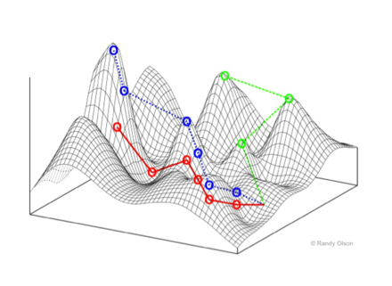
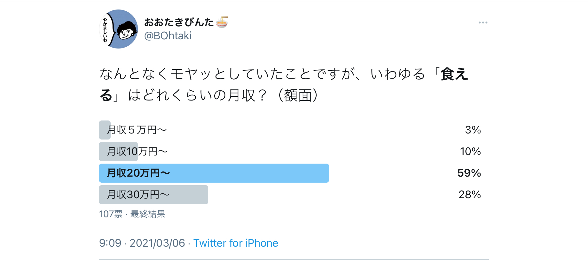
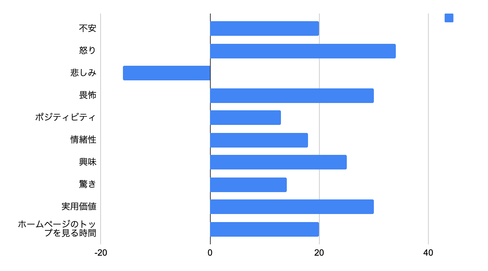
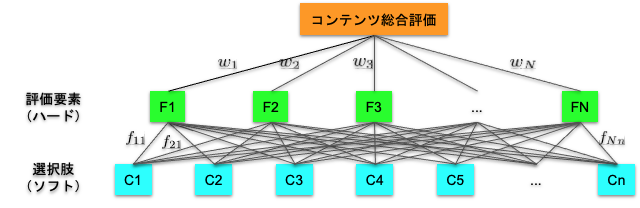
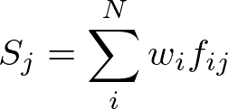
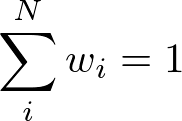
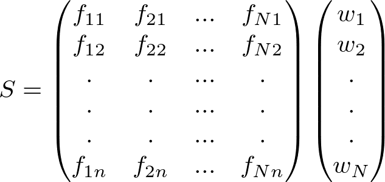
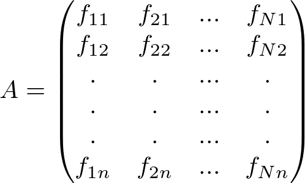
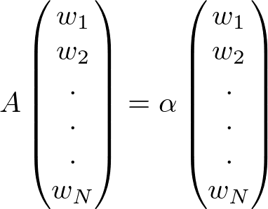
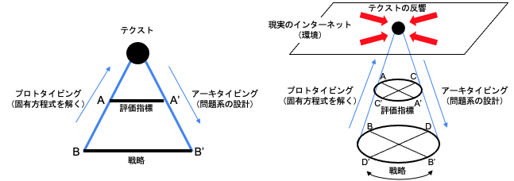

# 大滝瓶太

# 担当する目次
8.執筆：文体／語句／構文／内容／構成／倫理

# 主題
WEBライティングの熱力学的な死──そのテクストの「意思」の所在

# プロフィール
86年生まれ。作家。「SFマガジン」（早川書房）や「小説すばる」（集英社）で小説・書評などを執筆。

# 初稿

>  少年たちは流行のダイエット法を売り込む場合と同じく、自分たちのターゲットが欲しがりそうだという理由だけで政治に関する嘘を書き込んだ。 \
──P. W. シンガー・エマーソン.T .ブルッキング著、小林由香利訳、『「いいね！」戦争　兵器化するソーシャルメディア』

## 自己組織化する文章表現

いまもってこうして文章を綴りながらも、じぶんの意思というのはわからない。

もちろん何かを考え、大なり小なりの伝達を試みようとはしていて、おそらくじぶん以外に書けるものではないけれど書いたじぶんですら一字一句辿りなおすことなんてできないこの文章は、果たしてどこからやってきたのか。文章は、ぼくの手で書かれながらもぼくではない意思によって構造化されていく。ぼくの意思ではなく、ライティングというシステムによって。

数理生物学で用いられる「適応度地形」は、ある生物個体が任意のパラメータで定義された環境にどれだけ適すかを示したグラフである（Figure1）。高いほど快適な環境を示し、従って生物個体は手当たり次第に近くの山の頂上を目指して登ろうとする。たとえば、暗闇で生きる生物は視覚を退化させ聴覚を発達させる。この運動が観念上の「進化」と呼ばれるものであり、生物個体は適応度を最大にするようにして身体機能を変化させていく。

**Figure 1 適応度地形（イメージ）** \
（引用：[https://ja.wikipedia.org/wiki/適応度](https://ja.wikipedia.org/wiki/適応度)）

しかしそれは生物個体みずからの意思ではなく、あくまでも環境に要請された変化であり、あえて大袈裟に言えば「生きよう」とする意思は生物個体の本能ですらないのかもしれない。ただそこに存在してしまったという事実が個体を生き延びさせていて、「わたし」の形を「わたしたち」は選べない。

問題は、局所最大値にトラップされることだ。ある山のてっぺんにいても「実はもっと高い山がありました」となるのは珍しくなく、これはなかなか嬉しくない。昨今、内容・形式・文体が「全部なんとなく似ている」WEBライティングが氾濫していることもその一例だろう。

本稿で対象にするのはこの薄弱にしてあらがい難い、ときに「神の見えざる手」とも呼ばれる何者かの所在だ。WEBメディアの発展にともない劇的に発達したWEBライティングを題材に、その表現が最適化されるシステムならびに数理モデルを仮定し、自然現象としての文章表現について考察する。

## WEBライティングの評価指標と原稿料

インターネットを経由してぼくらが日々摂取する情報のほとんどは文字のかたちをしている。ネットニュース、ブログ、SNS、メッセージングツールなどなど、だれかの手によって吐きだされる文字たちは不特定多数の「わたしたち」の目から脳へと染み込んでゆく。社内外切抜通信社によれば、2009年から2018年にかけて新聞・雑誌の発行部数は26.3%減少した一方、WEBメディアの媒体数は2.7倍の4,018サイトに増えていて（[出典](https://digitalpr.jp/r/30895)）、消費される文字情報の量とスピードは新たな生態系をつくりだした。

2000年代後半から2010年代前半は「ネットで文章を書けば金になる」ことがなんとなく知られるようになった時代だった。文筆業は専門的な知識とスキルをつんだ人間の仕事だと思われていたが、「いつでも・どこでも」仕事ができる手軽さに、「物書きとして働きたい」というぼんやりとした憧れがあいまって、WEBライティングが「だれでも簡単にはじめられる内職」として広まった結果、WEBライターの生産性を軸にした報酬体系が形成されるに至った。

**Table 1 WEBライターの原稿料相場**
（引用：[https://upwrite.jp/blog/35](https://upwrite.jp/blog/35)）

<table>
  <tr>
   <td>
   </td>
   <td>１文字あたりの単価相場
   </td>
   <td>補足
   </td>
  </tr>
  <tr>
   <td>有名ライター
   </td>
   <td>100円以上
   </td>
   <td>SEOやバズで数字を持っているライター
   </td>
  </tr>
  <tr>
   <td>上級ライター
   </td>
   <td>15円〜20円
   </td>
   <td>豊富な経験、元記者、専門領域を持つライター
   </td>
  </tr>
  <tr>
   <td>中級ライター
   </td>
   <td>3円〜15円
   </td>
   <td>ライターとしての社員経験や数年以上の経験があるライター
   </td>
  </tr>
  <tr>
   <td>初心者ライター
   </td>
   <td>1円〜3円
   </td>
   <td>未経験からスタートしてある程度しっかりした記事を書けるライター
   </td>
  </tr>
  <tr>
   <td>未経験ライター
   </td>
   <td>0.1円〜1円
   </td>
   <td>ほとんど記事を書いたことがないライター
   </td>
  </tr>
</table>

Table 1は、WEBライターのおおまかな原稿料相場の例だ。実績もコネもなくWEBライターになると最下層「未経験ライター」からキャリアがスタートする。仕事は「企業・店舗の商品販促」がメインで「SEO（検索エンジン最適化）」を意識した記事制作を行う。ちなみにぼくがはじめて受けた仕事の原稿料は1文字あたり0.2円（1記事60円）だった！

過去にぼくはTwitterでこんなアンケートをとってみたのだが（Figure 6）、どうやらぼくのまわりでは月収20万円程度が「食える」のボーダーラインらしい。0.2円とは言わずとも「1円ライター」と呼ばれる文字単価1円でさえ、毎月20万文字を書いてやっと食える。これはちょっとした長編小説１冊分の長さだ。

**Figure 2「食える」月収とは？**
[https://twitter.com/bohtaki/status/1367990588608368642?s=21](https://twitter.com/bohtaki/status/1367990588608368642?s=21)

## WEBで価値のあるテクストとは？

WEBライターになるのはかんたんだけど、文字単価が低ければ、書いても書いても最低限「食える」収入は得られそうもない。どうすれば単価が上がるのか──その方法は「クライアントの便益に貢献すること」に尽きる。そして、ほぼすべてのWEBメディアが抱えるビジネス課題──それが閲覧数（PV）だ。WEB記事はPV数を最大化するように制作され、「PV至上主義」と呼ばれることもある。

やみくもなPV至上主義によって登場したのが「ワードサラダ」と「炎上記事」だ。「ワードサラダ」は過剰な検索エンジン対策として大量のキーワードを盛り込んだ可読性の低い記事を量産し、対象読者が人間ではなくクローラーになってしまった。一方で炎上記事は扇情的なタイトルと内容を駆動力とした記事で、人間の感情を攻略することに特化している。

Figure 3 を見て欲しい。ニューヨーク・タイムズの7000件の記事をもとに、ある感情をもたらす記事が、同紙の「いちばんEメールされた記事」リストにどれだけ登場するかを調べたものだ。拡散しやすい記事はポジティブ／ネガティブな感情を強く喚起する性質を持ち、特に「怒り」がもっとも高い。

**Figure 3 記事の拡散と感情**　元データはBerger, J., and Milkman, K. L., “What Makes Online Content Viral,”, Journal of American Marketing Research, 2011 グラフはオリバー・ラケット、マイケル・ケーシー著『ソーシャルメディアの生態系』掲載図を筆者が再現

敷衍すると、「ワードサラダ」も「炎上記事」も、PV至上主義という極端に偏った戦略が採用されることで、制作された記事の「読みもの」としての評価が著しく低く、あるいはいびつになってしまった。

## 意思決定数理モデルから解釈する「WEBライティング」

そうだとすれば、 WEBライティングが「全部なんとなく似ている」原因は、書き手に内在する意思ではなく、むしろ外在する制度によってテクストが最適化されているためではないか。

**Table 2 WEBライティングの評価指標と戦略の例**

<table>
  <tr>
   <td rowspan="7" >評価指標
   </td>
   <td rowspan="4" >ページ解析
   </td>
   <td>PV（ページビュー）
   </td>
  </tr>
  <tr>
   <td>滞在時間
   </td>
  </tr>
  <tr>
   <td>CTR（クリックスルーレート）
   </td>
  </tr>
  <tr>
   <td>CVR（コンバージョンレート）
   </td>
  </tr>
  <tr>
   <td rowspan="3" >ソーシャルメディアのリアクション
   </td>
   <td>インプレッション（imp）
   </td>
  </tr>
  <tr>
   <td>いいね（Like）
   </td>
  </tr>
  <tr>
   <td>シェア数
   </td>
  </tr>
  <tr>
   <td rowspan="9" >戦略
   </td>
   <td rowspan="3" >企画内容
   </td>
   <td>テーマ設定
   </td>
  </tr>
  <tr>
   <td>ターゲット（読者）設定
   </td>
  </tr>
  <tr>
   <td>執筆者
   </td>
  </tr>
  <tr>
   <td rowspan="3" >公開方法
   </td>
   <td>掲載メディア
   </td>
  </tr>
  <tr>
   <td>コンテンツの長さ
   </td>
  </tr>
  <tr>
   <td>期待する感情喚起
   </td>
  </tr>
  <tr>
   <td rowspan="3" >予算・収益
   </td>
   <td>原稿料
   </td>
  </tr>
  <tr>
   <td>広告／スポンサー
   </td>
  </tr>
  <tr>
   <td>マネタイズ手法
   </td>
  </tr>
</table>

Table 2 にまとめたのはWEBテクストの評価指標と戦略だ。評価指標はWEBメディアに介入の余地がないのに対し、戦略はWEBメディアの裁量で変更でき、特定の評価指標を前提とした戦略がされることでWEBライティングの表現は決まる。これは一種の意思決定問題と解釈でき、その数理モデルを検討した。

Figure 4 は階層分類法を用いてテクストの総合評価を構造化したものだ。複数の評価指標がWEBライティングの総合評価を構成し、評価指標に作用する戦略が下層に配置される。

**Figure 4 階層分析法に基づくWEBライティングの評価モデル**

このとき、戦略Cjが評価指標Fiに与える影響をfij、各評価指標の重要度（重み）をwiとすると、戦略Cjにより制作されたWEBテクストの評価値Sjは以下の式で定義される。

(1)

(2)

評価値Sjは冒頭でのべた数理生物学における「適応度」に該当する。では、手持ちの戦略Cjがわかっているとき、重みwiはどのように求めることができるのか？

すべての戦略を考慮した総合評価Sは以下のように表現できる。

(3)

ここで左からかかるN×nの行列をAと置くと、意思決定に関わる重みwiは以下の固有方程式の問題に帰着する。

(4)

(5)

この固有方程式は正方行列ではないため、めちゃくちゃめんどくさい。意味のあるかたちで解くにはいろいろと工夫が必要になる。それはまた別の機会にしたい。

## テクストの熱力学的な死にあらがう意思

理屈の上ではこの固有方程式を解くことで、WEBライティングの表現が決定される構造を特定できるとわかった。最後に、Figure 5で問題の全体像を確認したい。

**Figure 5 プロトタイピング−アーキタイピングの反復（郡司ぺギオ幸夫『生命、微動だにせず　人工知能を凌駕する生命』、デジャヴ・逆ベイズ推論の議論より筆者が着想）**

問題解決には2つのアプローチがある。多数の可能な戦略を絞り込んでテクストをかたちにするボトムアップの「プロトタイピング（固有方程式を解く）」と、テクストの反響から改善策となる戦略を新たに想起するトップダウンの「アーキタイピング（問題系の設計）」だ。

2つの反復を経てテクストは最適化され、両者を切り離して考えるのは不可能であり、機械的演算と不確定な想起が混在した問題として扱われなければならない。一定の問題系のもとで反復するごとに最適値へ接近しているわけではなく、反復ごとに問題系は更新され、やがて問題系が収束したとき──生物の進化の方向が一意的に決まるように──あらゆるWEBライターが同じものを書く。

書き手に内在する意思が外的因子に対して無視できるほど小さくなるとテクストに熱力学的な死が訪れる。ぼくらに意思はある。現実のインターネットに晒されるテクストは、その出自たる問題系が更新され続けることにより約束された死を遠ざける。その抵抗が、未だだれも見たことがない文字列を嗚咽とともに吐き出すのだ。

## 参考文献
- 齊藤芳正著、『はじめてのオペレーションズ・リサーチ』（ちくま学芸文庫）、2020年
- スチュアート・カウフマン著、米沢富美子訳、『自己組織化と進化の論理　宇宙を貫く複雑系の法則』（ちくま学芸文庫）、2008年
- 今野浩・後藤順哉著、『意思決定のための数理モデル入門』（朝倉書店）、2011年
- P. W. シンガー・エマーソン.T .ブルッキング著、小林由香利訳、『「いいね！」戦争　兵器化するソーシャルメディア』（NHK出版）、2019年
- Berger, J., and Milkman, K. L., “What Makes Online Content Viral,”, _Journal of American Marketing Research_, 2011 
- オリバー・ラケット、マイケル・ケーシー著、森内薫訳、『ソーシャルメディアの生態系』（東洋経済新報社）、2019年
- 郡司ぺギオ幸夫著、『生命、微動だにせず　人工知能を凌駕する生命』（青土社）、2018年

※こちらは「初稿」です。「完成稿」は購読者限定です。購読チケットは[STORES](https://authors-note.stores.jp/)から。

	<a href="https://authors-note.stores.jp/" class="button">チケットを購入する</a>

# [TOPページ](./index.md)
